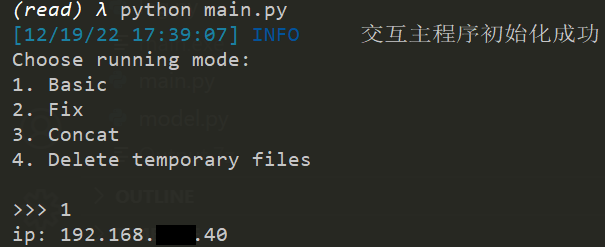

# 简单的听书音频生成

这是一个为[阅读3](https://github.com/gedoor/legado)制作的生成章节音频的程序。
由于作者能力，仅仅是CLI工具。

## 安装

### 拥有python环境和基础

- 克隆当前存储库
- 安装依赖: `pip install -r requirment.txt`
- 下载[ffmpeg.exe](https://www.gyan.dev/ffmpeg/builds/ffmpeg-release-essentials.7z)并保存在当前程序相同文件夹，或在`path`中设置.

### 没有python环境

- 在最新的[Release](https://github.com/flt6/Read_tts/releases/latest)中下载`main.exe`
- 下载[ffmpeg.exe](https://www.gyan.dev/ffmpeg/builds/ffmpeg-release-essentials.7z)并保存在当前程序相同文件夹，或在`path`中设置.

## 用法

- 在阅读app中打开`Web 服务`, 并且记录显示的ip地址。

- 运行这个程序, 并输入`1`.

- 输入记录的ip地址

- 输入书籍id

- 输入开始和结束的页面id，您可以在开始处留空，这意味着选择当前章节。提示格式： `(<id>: <标题>)`. id有时会由于书源造成误差, 您可以根据开始章节的id数据计算这个误差。

- 接着等待程序运行结束即可！

## 菜单

### 1. Basic

基础模式，您可以根据交互提示和上述内容使用。

### 2. Fix

如果你看见 `Retry (for fix mode)`, 那么你便需要运行这个模式。这意味着某个章节的音频合成失败了太多次.(你可以通过[`MAX_RETRY`](#configurations)修改这个数据) 你可以复制 `Retry (for fix mode)`后的数据并输入在提示中, 然后程序便会像标准模式运行。

### 3. Concat

如果你的程序意外退出, 那么文件夹中便会出现像 `340_第xxx章xxx (1).mp3`这样的文件。如果你遇到了这个情况，你可以运行这个模式自动修复这个错误。**注意: 如果某个章节下载了部分，那么可能出现未知情况（通常出现于最后几个）**

### 4. Delete temporary files

如果你在输出文件夹中发现`340_第xxx章xxx (1).mp3`或者控制台中有`ERROR: _merge: Permission denied!`，这是一个**已知bug**（还没调试明白，如果谁有思路，请麻烦提一下Issue）. 你可以通过运行这个模式来修复。[3](#Notes)

## 配置

你可以运行一次主程序，便会生成`config.json`，并附有默认配置。你可以修改，或者使用自定义json，这个json必须是原json的子集。程序会自动检查类型和key，在软件更新过程中，部分参数有删除或改动，软件会自动更新到最新参数。如果您确定您的json在老版可用但新版不可用，请在Github上提Issue。

|名称|类型|默认|含义|
|-|-|-|-|
|MAX_RETRY|int|5|重试次数最大值|
|MAX_TASK|int|10|最大并行任务数|
|MAX_CHAR|int|1500|单个音频最大字数, 你可以查看[这个](https://github.com/kxxt/aspeak#limitations)|
|WAIT_TIME|int/float|5|两次重试间等待时间|
|RETRY_SUB|int/float|2|当重试时，任务数会除以`MAX_TASK`[1](#Notes)|
|MAX_WAIT|int|20|最大等待时间[2](#Notes)|
|TRANS_MODE|int|2|转化模式：目前有效值为基础模式(1)、角色模式(2)[4](#Notes)|
|TIMEOUT|int/float|3|链接到app的超时值（单位：秒）|
|OPT_DIR|int|Output|输出文件夹|
|SHOW_DEBUG|bool|`false`|显示调试信息|
|SAVE_LOG|bool|`true`|保存日志信息|
|SAVE_REQ|bool|`false`|保存所有请求记录（用于反馈）|
|TO_CONSOLE|bool|`true`|在控制待中显示日志(**包括INFO和ERROR信息**)|
|LANG_FILE|str|`zh`|语言文件[5](#Notes)|
|ip|str||app的ip（包含端口）|

## 语言

目前已制作两种语言的语言数据，默认为英文，可以在`config.json`中的修改`LANG_FILE`。
目前已有`lang_chk.py`检验语言文件，**但是运行方式过于草率，可能会出现安全问题，请仅用于已知来源文件！**

## 运行模式

对于模式1：基础模式；对于模式2：角色模式。角色模式通过引号等常用符号标记角色语言内容，将该部分内容换为另一角色合成。

### 识别的符号

- “文本”
- "文本"
- 【文本】
- '文本'

### 自动回退

注：对于文章中出现以下情况，角色模式将自动回退到基础模式（将提示错误）。

1. 文章中出现引号不匹配。如

> 文本“对话内容<b>“</b>

2. 文本中存在引号不配对的情况。如

> 文本<b>“</b>对话内容。
> 其余内容“对话内容”

## Notes

1. 如果音频合成失败，程序会重试`MAX_RETRY`次。在重试后，同时运行的任务会除被以`RETRY_SUB`，并且等待`WAIT_TIME`秒。
2. 我使用了`aspeak`模块来合成音频，但是只有一些[限制](https://github.com/kxxt/aspeak#limitations)。其中还有一个没有被记录的限制：不能短时间内合成多次。如果合成失败率大于`LIMIT_429`，并且完成（失败）了`FAIL_429`个音频，程序会等待正在运行的所有任务结束，然后等待`9+3*stop_cnt`。其中，变量`stop_cnt`是总失败次数，并且等待时间不会超过`MAX_WAIT`。如果超过，便会将等待时间固定为15s。
3. 最后一个文件好像会被ffmpeg或者python进程占用，这似乎不是我的代码的问题，因为只有在windows平台上出现。
4. 运行模式[见上](#运行模式)
5. 内置语言文件`zh`和`en`，对应源文件`lang_zh.json`和`lang_en.json`，如果想要修改语言文件，请同时修改config中的`LANG_FILE`，即便文件名`lang_zh.json`或`zh`也不行。

## FAQ

### Q: Showe text like "\033****" and so on

A: use cmder to run it, the console should support ANSI colorful output.

### Q: Find file like `<TiTle>(1)`

A: Start main program again and run mode `4`

### Q: The program interrupted unexpectedly, but there are many `<title>(1)` in output folder

A: Start main program again and run mode `3`
