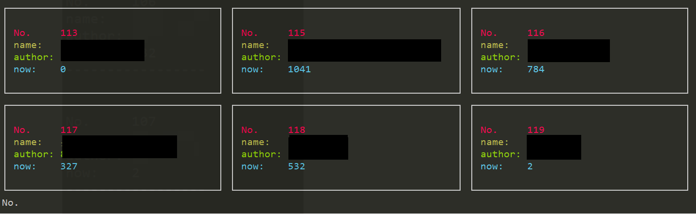
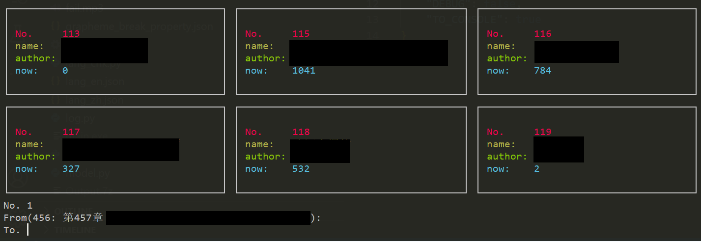

# A simple TTS for TTS app

This is a CIL program to fetch chapters from [Read App](https://github.com/gedoor/legado) and generate mp3 files.

## install

### with python environment

- clone this responsity.
- install dependencies: `pip install -r requirment.txt`
- download [ffmpeg.exe](https://www.gyan.dev/ffmpeg/builds/ffmpeg-release-essentials.7z) and save it in the same directory as the program or set in `path`.

### without python environment

- download executable file in the latest Release.
- download [ffmpeg.exe](https://www.gyan.dev/ffmpeg/builds/ffmpeg-release-essentials.7z) and save it in the same directory as the program or set in `path`.

## Usage

- Open `Web Service` in Read App, and remember ip showed here.

- Run this program, and type `1`.

- Input app ip showed in App

- Choose book with book id.

- Type start id and end id. You can leave blank in start id which means from the current chapter showed like `(<id>: <Title>)`. Id may be vary from -5 to +5, and you can refer to the start id.

- Then you can wait the program finish!

## Manu

### 1. Basic

Basic mode, you can run it by following promots.

### 2. Fix

If you find text like `Retry (for fix mode)`, you may need this mode. That means some of chapters failed for many times.(You can set this value in [`MAX_RETRY`](#configurations)) If you meet this, you can use this mode and type numbers showed after `Retry (for fix mode)`, and it will run like basic mode.

### 3. Concat

If the pragram is exit unexpectedly, there will be files like `340_第xxx章xxx (1).mp3`. You can run this mode, and it'll automatic fix these files. **ATTENTION: IF ONE CHAPTER IS ONLY DOWNLOAD PARTLY, THE AUDIO CONDITION MAY BE UNKOWN**

### 4. Delete temporary files

If you see files like `340_第xxx章xxx (1).mp3` for the last chapter, this is an known bug. You can run this to fix it.

## configurations

|name|type|default|mean|
|-|-|-|-|
|MAX_RETRY|int|5|The max retry when fail|
|MAX_TASK|int|10|The max taks to run at the same time|
|MAX_CHAR|int|1500|The max character for one audio, you can refer to [this](https://github.com/kxxt/aspeak#limitations)|
|WAIT_TIME|int/float|5|Wait time during two retries|
|RETRY_SUB|int/float|2|When starting retry, `MAX_TASK` will be divided this value[1](#Notes)|
|MAX_WAIT|int|20|Max time to wait[2](#Notes)|
|TIMEOUT|int/float|3|Timeout when connecting to App|
|OPT_DIR|int|Output|Output folder|
|SHOW_DEBUG|bool|`false`|Show debug infomation|
|SAVE_LOG|bool|`true`|Save log information|
|TO_CONSOLE|bool|`true`|Show log(**including INFO and ERROR info**) to console|

### Notes

1. If any audio failed to synthesize, this program will retry to synthesize for `MAX_RETRY` times. And the multiple tasks count will divide `RETRY_SUB`, and wait `WAIT_TIME` seconds.
2. We used module `aspeak` to synthesize audio, but there are some [limitations](https://github.com/kxxt/aspeak#limitations). There is a limitation not mentioned in that page. Task can't be running for too many times. I set a fix method: If failing persent for over `LIMIT_429` times, and over `FAIL_429` tasks have ran, the program will wait for `9+3*stop_cnt`. Var `stop_cnt` shouldn't over `MAX_WAIT`, if so, the program will set `stop_cnt` to `15`

## FAQ

### Q: Show text like "\033****" and so on

A: use cmder to run it, the console should support ANSI colorful output.

### Q: Find file like `<TiTle>(1)`

A: Start main program again and run mode `4`

### Q: The program interrupted unexpectedly, but there are many `<title>(1)` in output folder

A: Start main program again and run mode `3`
